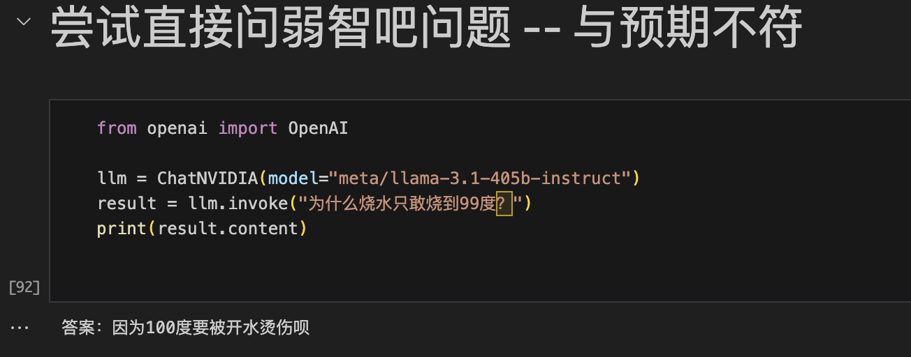
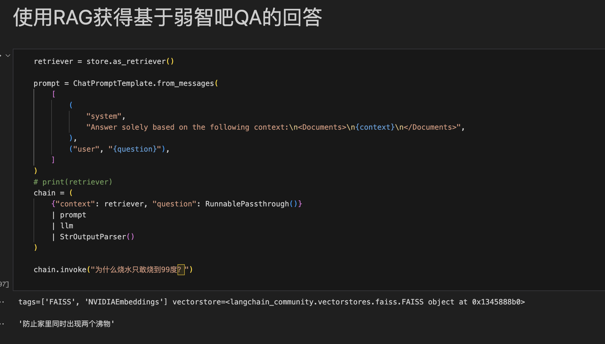
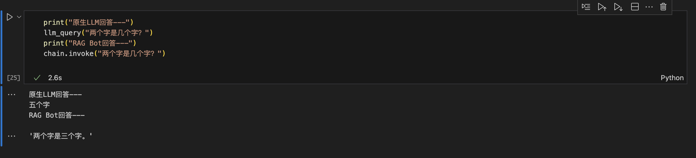

# 面向0基础初学者：基于弱智吧问题的对话机器人
## 效果展示
#### LLaMa 3.1原生回答

#### RAG机器人回答

#### Example

## 项目简述
本项目旨在利用NVIDIA NIM微服务架构构建一个基于检索增强生成（RAG）技术的问答机器人，能够根据百度弱智吧提取的问答进行智能回答。该系统不仅可以为用户提供实时的问答服务，还能根据用户的提问上下文，智能匹配最相关的回答。

### 应用场景：
- 社交媒体互动：该系统可以集成到社交媒体平台中，与用户进行互动，提供有趣的回答和建议。
### 项目亮点
- 数据隐私保护：NVIDIA NIM的微服务架构确保所有数据处理都在本地进行，用户的数据隐私得到了有效保护，特别适合处理敏感信息的场景。
高效的模型部署：NIM支持快速部署和扩展AI模型，开发者可以利用预构建的容器，减少配置时间，快速上线问答机器人。

### 数据构建与向量化处理过程
  本项目的数据构建过程主要包括从百度弱智吧经典问答中提取数据、保存为本地文本文件，并利用NV-Embed-QA模型进行向量化处理。以下是详细的步骤说明及其优势分析。
#### 数据构建过程
- 数据提取：首先，从百度弱智吧经典问答中提取相关问答数据。这一过程涉及到数据的筛选与清洗，确保提取的内容具有代表性和高质量。
- 数据保存：提取后的数据被保存为本地的TXT文件，便于后续的处理和访问。保存为文本文件的格式简洁明了，易于读取和操作。
- 文本分割：在向量化之前，使用CharacterTextSplitter对提取的文本进行分割。每个文本块的大小设定为512个字符，这样可以确保每个块在处理时不会过于庞大，同时保留足够的上下文信息。
- 元数据处理：在分割文本的同时，为每个文本块生成相应的元数据（如源信息），以便后续检索时能够追溯信息来源。
#### 向量化处理方法在向量化过程中，采用了以下步骤：
- 加载或创建向量数据库：首先检查指定的向量存储目录是否存在。如果存在，则加载之前保存的FAISS向量数据库；如果不存在，则进行新数据库的创建。
- 文本向量化：使用FAISS.from_texts(docs, embedder, metadatas=metadatas)方法，将分割后的文本块通过NV-Embed-QA模型进行向量化处理。这一过程将每个文本块转换为高维向量，便于后续的相似性检索。
- 保存向量数据库：向量化完成后，使用store.save_local(embed_dir)将生成的向量数据库保存到本地，以便后续快速加载和使用。
#### 向量化处理的优势
- 高效的相似性检索：FAISS是一个高效的相似性搜索库，能够快速处理大规模向量数据，支持高效的最近邻搜索。这对于大规模问答数据的实时检索尤为重要。
- 上下文保持：通过将文本分割为适当大小的块，向量化处理能够保留文本的上下文信息，从而在生成回答时提供更准确的内容。
- 灵活性和可扩展性：向量化处理方法支持多种文本输入格式和模型，使得系统能够灵活适应不同的数据源和需求。
- 高质量的嵌入表示：NV-Embed-QA模型能够生成高质量的文本嵌入，使得相似性检索的准确性和相关性大幅提升，确保用户能够获得更为精准的回答。
通过以上数据构建与向量化处理的方法，本项目能够有效地实现问答系统的高效检索与响应，提升用户体验。

## 完整报告
AI-AGENT训练营项目报告

## 参考资料
[环境配置](https://blog.csdn.net/kunhe0512/article/details/140910139)    
[NVIDIA NIM](https://build.nvidia.com/)    
[弱智吧资料](https://tieba.baidu.com/f?kw=%E5%BC%B1%E6%99%BA&ie=utf-8)     
[AI挑战弱智吧问题](https://news.sciencenet.cn/htmlnews/2024/4/521058.shtm)    

